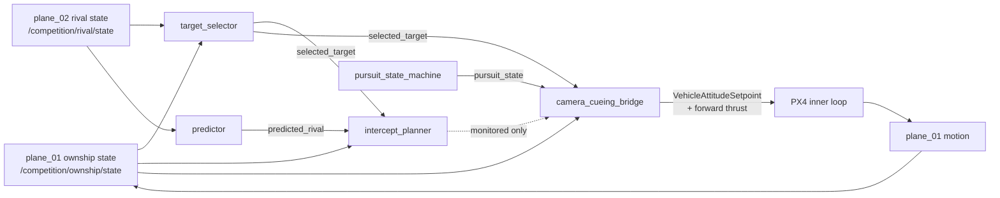
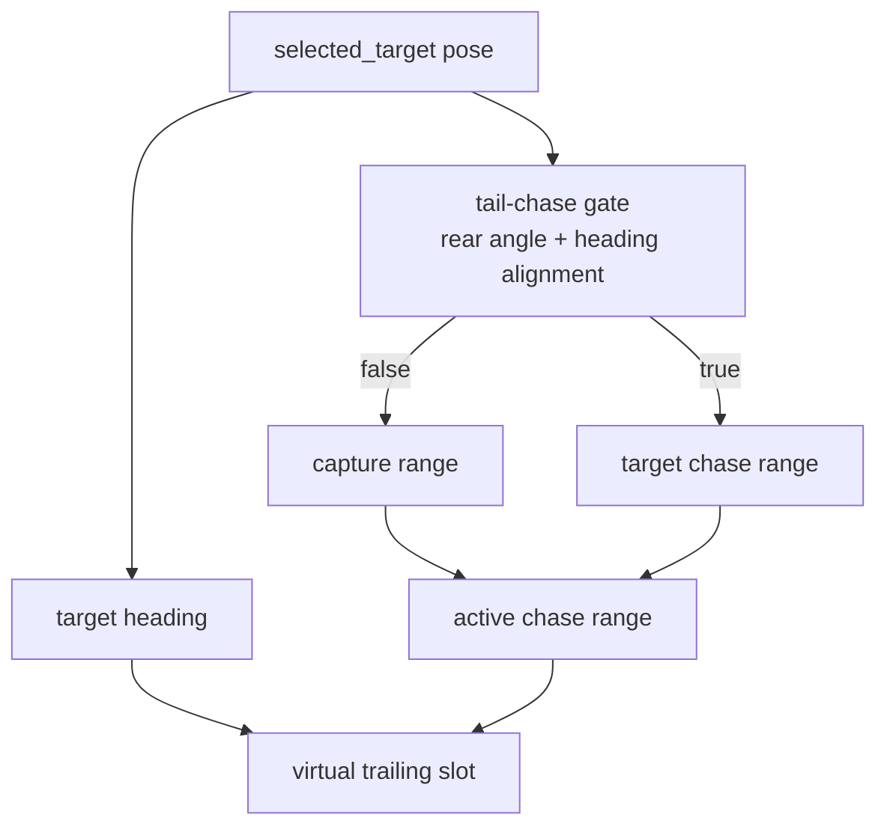
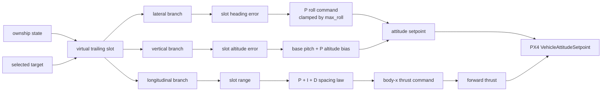
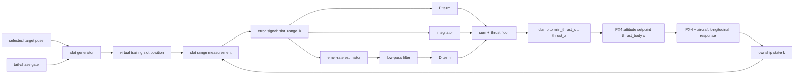
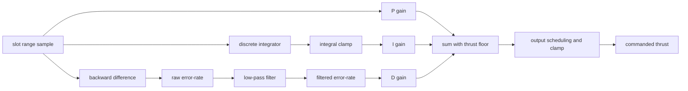
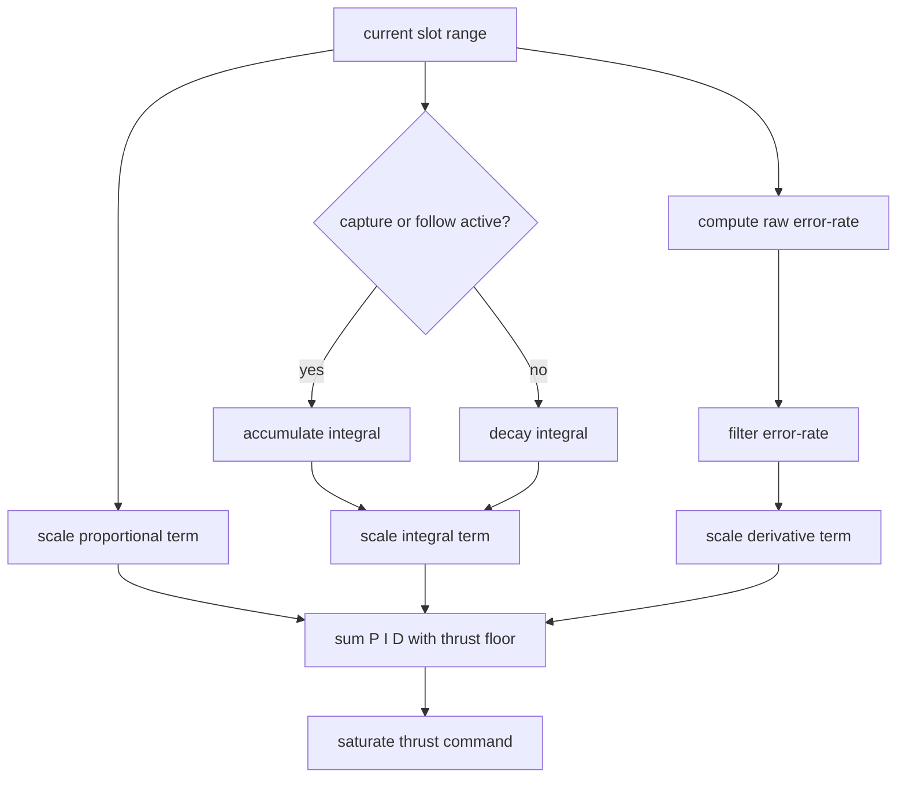
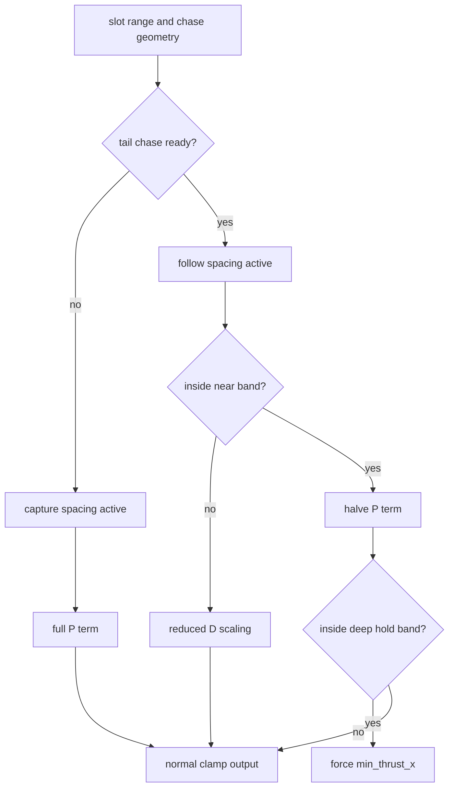
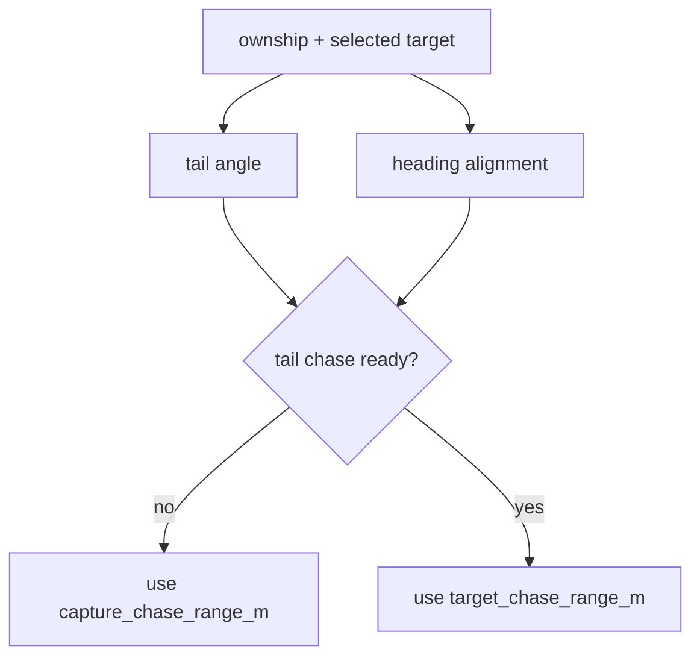

# Phase 6 Controller Scheme

This page documents the current phase-6 cueing controller exactly as it is implemented now. It is meant to support controller review and design discussion before more tuning or redesign.

## Purpose

The phase-6 controller is the outer-loop guidance block for `plane_01`. It uses live ownship state and the selected rival state to build a trailing reference, then publishes PX4 attitude setpoints plus forward thrust.

Current responsibilities:

- compute a virtual trailing slot behind the selected rival
- steer laterally and vertically toward that slot
- regulate forward thrust from slot-spacing error

It does not implement visual detection, lock scoring, or a full formation controller.

## Top-Level Data Flow

Important current fact:

- `camera_cueing_bridge` consumes `selected_target`
- it does not directly steer to `intercept_target`

## Target Reference Scheme

The controller does not fly directly at the rival body. It derives a virtual trailing slot from the selected target pose.

Inputs used for the slot:

- selected target position
- selected target heading
- active chase range

The active chase range has two regimes:

- `capture_chase_range_m` before valid tail chase
- `target_chase_range_m` after valid tail chase

## Internal Controller Branches

The current controller is a slot-following outer loop with three branches.

### Lateral branch

The lateral branch computes heading error from ownship to the trailing slot and converts it to a bounded roll demand. This is the branch that has generally been working best in recent runs.

### Vertical branch

The vertical branch compares ownship altitude to slot altitude and adds a simple pitch bias. It is a bounded altitude bias, not a full energy controller.

### Longitudinal branch

The longitudinal branch is the part under active tuning. It currently uses:

- `P`: slot-range error
- `I`: integrated slot-range error with clamp
- `D`: filtered slot-error rate
- output: forward body thrust command between `min_thrust_x` and `thrust_x`

This is the branch most likely responsible for the current settle-too-far-back versus overshoot tradeoff.

## Longitudinal Feedback Loop

The implemented longitudinal controller is easier to reason about as a discrete-time loop around the virtual trailing slot.

Important current fact:

- the controller does not regulate raw rival distance directly
- it regulates distance from ownship to the virtual trailing slot
- the desired `5 m` follow spacing is encoded by where the slot is placed, not by subtracting `5 m` inside the PID equation

### Discrete Update Equations

At sample index `k`, with controller period `T = dt`:

- slot range measurement: `s_k = ||slot_k - ownship_k||`
- raw slot-error rate: `r_raw_k = (s_k - s_{k-1}) / dt`
- filtered slot-error rate: `r_filt_k = (1 - alpha) * r_filt_{k-1} + alpha * r_raw_k`
- integral state in active capture/follow: `I_k = clamp(I_{k-1} + s_k * dt, -I_lim, I_lim)`
- integral state outside active capture/follow: `I_k = 0.9 * I_{k-1}`
- proportional term: `P_k = Kp * s_k`
- integral term: `U_I_k = Ki * I_k`
- derivative term before scheduling: `U_D_k = Kd * r_filt_k`
- unsaturated thrust: `u_raw_k = min_thrust_x + P_k + U_I_k + U_D_k`
- commanded thrust: `u_k = clamp(u_raw_k, min_thrust_x, thrust_x)`

This is why the current controller is best described as PI/PID-like on slot range, not on rival range.

### Implemented Gain Scheduling

The current longitudinal loop is not a plain fixed-gain PID. It includes these implemented nonlinear pieces:

- slot generation switches between capture spacing and follow spacing
- proportional term is halved near the final band in valid tail chase
- derivative term is scaled down when far away and not yet in tail chase
- derivative term is also scaled down when in tail chase but still outside the near band
- integral state only grows during active capture/follow and otherwise decays
- if ownship is deep inside the final slot band during valid tail chase, the controller returns `min_thrust_x` directly

### Simulink-Style Interpretation

A Simulink-style reading of the implemented controller is:

- reference model: selected-target to trailing-slot generator
- measurement block: ownship-to-slot distance
- derivative block: backward difference plus first-order low-pass filter
- integral block: discrete accumulator with clamp and conditional decay
- output nonlinearity: thrust saturation plus near-band thrust-floor override
- plant: PX4 inner loop plus fixed-wing airframe longitudinal dynamics

So the current tuning problem is not only choosing `Kp`, `Ki`, and `Kd`. It is also choosing them around a scheduled, saturated, sampled-data loop whose reference point moves with the rival.

## Tail-Chase Gating

The controller does not switch into the final short spacing immediately. It first checks whether ownship is already in acceptable rear-aspect geometry.

Current gates:

- tail angle within `capture_tail_angle_max_deg`
- heading alignment within `capture_heading_alignment_max_deg`

## What The Controller Does Not Use Directly

This is important for replay interpretation. The controller does not directly use:

- `intercept_target`
- `predicted_rival`
- raw rival history

Those are part of the broader phase-6 guidance stack, but the current controller directly tracks only:

- ownship state
- selected target
- pursuit state

So if the intercept target appears to lead the real rival in CZML, that is currently a planner observability fact, not the direct steering reference for the controller.

## Main Dynamic Weaknesses Observed So Far

- spacing settles too far back or overshoots
- capture-to-follow transition is sensitive to gains
- fixed-wing speed response is slower than the spacing law would ideally like
- the controller shapes thrust directly instead of commanding a higher-level speed target

The practical effect is that cue and bearing can become very good while stable rear-aspect range holding still fails.

## Main Runtime Parameters

| Parameter                           | Role                                          |
| ----------------------------------- | --------------------------------------------- |
| `thrust_x`                          | maximum forward thrust command                |
| `min_thrust_x`                      | minimum forward thrust floor                  |
| `range_thrust_gain`                 | proportional spacing gain                     |
| `range_integral_gain`               | integral spacing gain                         |
| `range_integral_limit`              | anti-windup clamp                             |
| `range_damping_gain`                | derivative-like damping gain                  |
| `closing_speed_filter_alpha`        | smoothing on slot-error rate                  |
| `target_chase_range_m`              | desired follow spacing after valid tail chase |
| `chase_range_tolerance_m`           | near-band tolerance                           |
| `capture_chase_range_m`             | larger spacing before valid tail chase        |
| `capture_tail_angle_max_deg`        | rear-cone gate                                |
| `capture_heading_alignment_max_deg` | same-heading gate                             |

## One-Sentence Summary

The current phase-6 controller is a selected-target-based virtual trailing-slot controller with P lateral steering, simple P vertical bias, and PI/PID-like longitudinal slot-range control, publishing PX4 attitude setpoints plus forward thrust.
