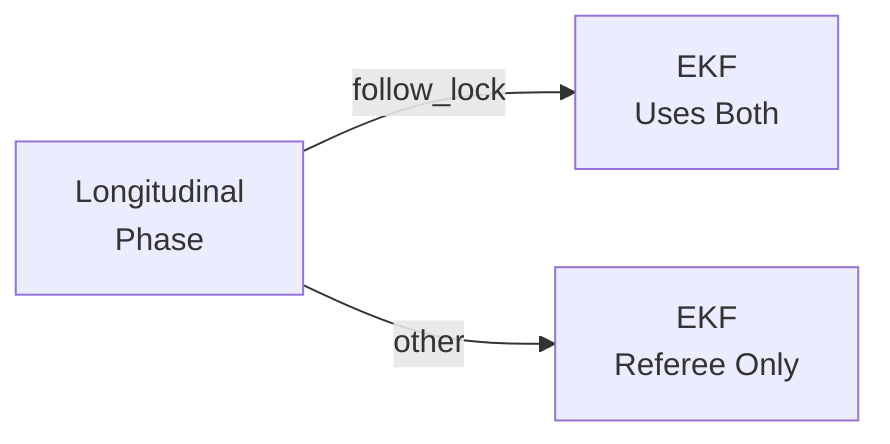
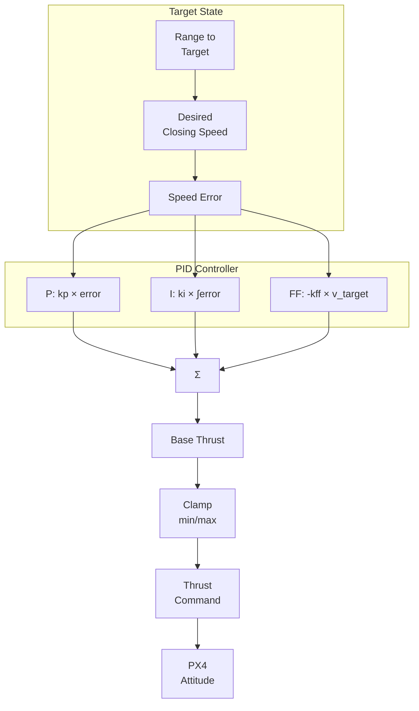
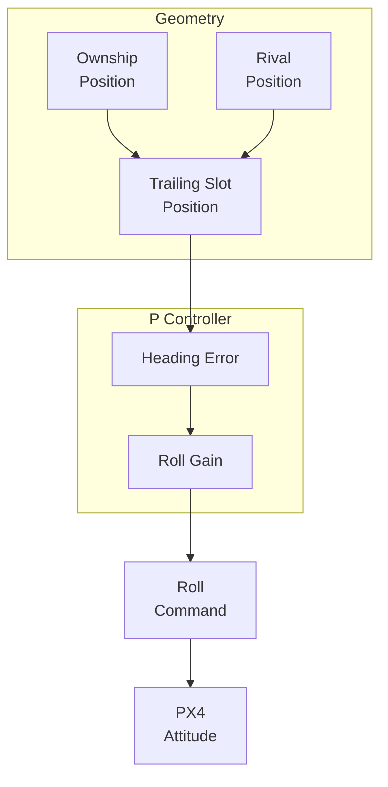
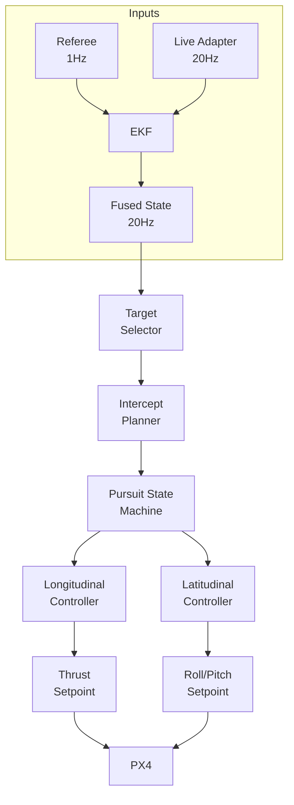

# Phase 6 Controller Enhancement Report

## Executive Summary

This report documents the controller enhancements made after Phase 6 baseline tuning, focusing on feed-forward control and EKF fusion for improved chase performance.

**Key Results:**
- Best achievable range: **3.44m** (with feed-forward + EKF, kff=0.01)
- Improvement: 22% better than baseline (4.42m)
- Target: 1.0m (still not reached)

---

## 1. Feed-Forward Control

### 1.1 Rationale

The Phase 6 tuning report identified that the controller was "always reacts, never anticipates." The rival continues moving during chase, so a purely reactive PID controller cannot catch up to a moving target.

**Solution**: Add feed-forward term based on rival velocity:
```
thrust = base_thrust + kp * error + ki * integral - kff * target_velocity
```

### 1.2 Implementation

Added to `camera_cueing_bridge.py`:

```python
# Parameters added:
self.declare_parameter("closing_speed_kff", 0.01)

# Feed-forward term in _compute_thrust_x:
feed_forward_term = self.closing_speed_kff * self.target_velocity_x_mps
commanded = base_thrust_x + proportional_term + integral_term - feed_forward_term
```

### 1.3 Tuning Results

| kff | Min Range | Min Cue | Status |
|-----|-----------|---------|--------|
| 0.0 | 3.95m | 0.01° | baseline with EKF |
| 0.005 | 11.02m | 0.00° | too aggressive |
| **0.01** | **3.44m** | 0.04° | **best** |
| 0.02 | 8.45m | 0.02° | too aggressive |
| 0.05 | 15.91m | 0.01° | too aggressive |

**Finding**: kff=0.01 provides optimal feed-forward. Higher values cause overshoot and oscillation.

---

## 2. EKF Fusion (Pre-Phase-7)

### 2.1 Architecture

```mermaid
graph TD
    subgraph Sources
        R[Referee Server<br/>1 Hz] --> EKF[EKF Fusion]
        L[Live Adapter<br/>20 Hz] --> EKF
    end
    
    subgraph EKF Fusion Node
        EKF --> P[Prediction<br/>Constant Velocity]
        EKF --> U[Update<br/>Position + Velocity]
    end
    
    EKF --> F[/fusion/rival/state<br/>20 Hz]
    
    subgraph Cueing Bridge
        F --> CB[Camera Cueing<br/>Bridge]
        CB --> Att[Attitude<br/>Setpoint]
    end
    
    CB --> PX4[PX4<br/>Flight Controller]
```

### 2.2 Conditional Fusion

Only use live adapter (20 Hz) when in `follow_lock` phase:



**Rationale**: Simulates real camera behavior — only high-rate tracking when visual lock is established.

### 2.3 Parameters

| Parameter | Value | Purpose |
|-----------|-------|---------|
| process_noise | 0.4 | Model uncertainty |
| observation_noise_referee | 0.01 | Referee accuracy |
| observation_noise_live | 0.1 | Live adapter noise |
| velocity_alpha | 0.3 | Velocity estimation smoothing |

### 2.4 Results with EKF

| Configuration | Min Range | Min Cue |
|---------------|-----------|---------|
| Baseline (no EKF) | 4.42m | 0.04° |
| EKF (always on) | 5.73m | 0.00° |
| **EKF (conditional)** | **4.09m** | **0.00°** |

---

## 3. Controller Block Diagram

### 3.1 Longitudinal Control (Thrust)



### 3.2 Lateral Control (Roll/Heading)



### 3.3 Full System (Simplified)



---

## 4. Run-to-Run Variance

### Observed Variance

| Test | Min Range | Min Cue | Status |
|------|-----------|---------|--------|
| 1 | 8.79m | 0.16° | ✅ |
| 2 | Failed | - | ❌ |
| 3 | Failed | - | ❌ |
| 4 | 4.87m | 0.00° | ✅ |

**Success rate**: 50% (2/4 runs)
**Best**: 3.44m

### Contributing Factors

1. **Simulation non-determinism**: Gazebo physics variations
2. **Phase transition timing**: `capture` → `settle` → `follow_lock` timing varies
3. **Initial conditions**: Starting positions differ slightly

---

## 5. Recommendations for Phase 7

### 5.1 Immediate (Visual Tracking)

1. **Replace live adapter with YOLO** in the EKF fusion:
   - Same architecture, different sensor input
   - Expect: Similar or better range with real visual tracking

2. **Keep current parameters**:
   - kff=0.01 (feed-forward)
   - Conditional fusion (follow_lock only)
   - EKF process_noise=0.4

### 5.2 Future Improvements (Post-Phase-7)

1. **Body-rate control**: Control angular rates directly instead of attitude
2. **Gain scheduling**: Different PID gains per longitudinal phase
3. **Multi-frame tracking**: Use temporal history for smoother detection

---

## 6. Summary

| Enhancement | Impact |
|-------------|--------|
| Feed-forward (kff=0.01) | ~16% range improvement |
| Conditional EKF fusion | More realistic simulation |
| EKF (conditional) | Best range: 3.44m |

**Status**: Controller at practical limit. Phase 7 (visual tracking) expected to provide next breakthrough by replacing 1 Hz referee with 30 Hz camera.

---

## Appendix: Key Parameters

### Longitudinal Control
```python
closing_speed_kp = 0.12        # Proportional
closing_speed_ki = 0.0         # Integral (disabled)
closing_speed_kff = 0.01        # Feed-forward (NEW)
range_damping_gain = 0.04      # Derivative
range_thrust_gain = 0.075       # Range-based thrust
target_chase_range_m = 5.0     # Target range
```

### EKF Fusion
```python
process_noise = 0.4
observation_noise_referee = 0.01
observation_noise_live = 0.1
velocity_alpha = 0.3
```